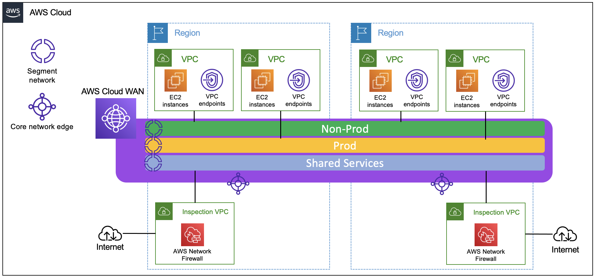

# AWS Cloud WAN - CDK Python

AWS Cloud WAN is a managed wide-area networking (WAN) service that you can use to build, manage, and monitor an unified global network that connects resources running across your cloud and on-premises environments. It provides a central dashboard from which you can connect on-premises branch offices, data centers, and Amazon Virtual Private Clouds (VPCs) across the AWS global network. You can use simple network policies to centrally configure and automate network management and security tasks, and get a complete view of your global network.

This repository shows you an example in CDK Python of global communication with AWS Cloud WAN, showing the same architecture you can build in the [AWS Cloud WAN Workshop](https://catalog.workshops.aws/cloudwan/en-US).

**NOTE**: The resources created incur costs in your AWS Account. Consider deleting the resources created once your tests are done. For more information, check the [AWS Cloud WAN pricing](https://aws.amazon.com/cloud-wan/pricing/).

## Deployment instructions

### Prerequisites

* A recent Python 3 (>= 3.6)

### Initial set up

* Install AWS CDK: `npm install -g aws-cdk`
* Clone this repo, `cd` into it and create a virtual environment: `python -m venv .venv`
* Activiate the virtual environment: `source .venv/bin/activate` (Windows: `.venv\Scripts/activate.bat` or `.venv\Scripts\Activate.ps1`)
* Install the required libraries: `python -m pip install -r requirements.txt`

### Deploying CDK stacks to account

This sample project is meant to be deployed to a single account and multiple regions. By default, the AWS regions configured are **us-east-1** and **eu-west-1**.

* AWS Cloud WAN needs to be deployed to *us-east-1* because of AWS Resource Access Manager sharing. When you share a regional service to accounts in your organisation, it will need to be shared in this AWS region.
* Other stacks can be deployed to any other region within the same account.

### Scripted deployment (non-Windows)

Run `./deploy.sh`

### Manual deployment

1. Deploy the CDK app: `cdk deploy --all`
2. The Cloud WAN stack will first deploy with an initial policy document. It will have all required configuration except routes towards egress, which cannot be generated in the first deployment due to a circular dependency. To create the routes, run the `update-policy-file.py` Python script, which will use the AWS APIs to find the required values and update the policy document, writing it to a new file.
3. Deploy the CDK app again. The CDK code will detect the new file and update the policy on the deployed CloudWAN instance: `cdk deploy CloudWAN`. (You can also deploy all stacks, although the others will have no changes.)

## References

* [AWS Cloud WAN documentation](https://docs.aws.amazon.com/vpc/latest/cloudwan/what-is-cloudwan.html).
* [AWS Cloud WAN Workshop](https://catalog.workshops.aws/cloudwan/en-US).
* Blog post: [Introducing AWS Cloud WAN (Preview)](https://aws.amazon.com/blogs/networking-and-content-delivery/introducing-aws-cloud-wan-preview/).

## Security

See [CONTRIBUTING](../CONTRIBUTING.md#security-issue-notifications) for more information.

## License

This library is licensed under the MIT-0 License. See the LICENSE file.
