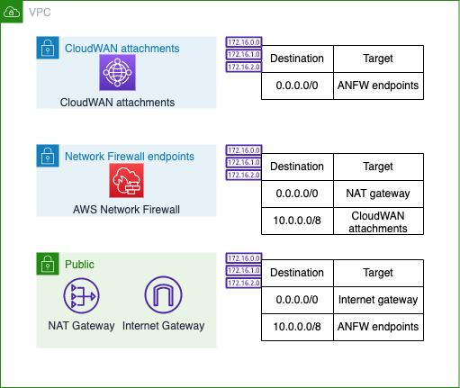

# AWS Cloud WAN - CDK Typescript

AWS Cloud WAN is a managed wide-area networking (WAN) service that you can use to build, manage, and monitor an unified global network that connects resources running across your cloud and on-premises environments. It provides a central dashboard from which you can connect on-premises branch offices, data centers, and Amazon Virtual Private Clouds (VPCs) across the AWS global network. You can use simple network policies to centrally configure and automate network management and security tasks, and get a complete view of your global network.

This repository shows you an example in CDK Typescript of global communication with AWS Cloud WAN, showing the same architecture you can build in the [AWS Cloud WAN Workshop](https://catalog.workshops.aws/cloudwan/en-US).


**NOTE**: The resources created incur costs in your AWS Account. Consider deleting the resources created once your tests are done. For more information, check the [AWS Cloud WAN pricing](https://aws.amazon.com/cloud-wan/pricing/).

## Resources deployed

### AWS Cloud WAN

The example creates AWS CloudWAN with three network segments:

* **Production**
  * Traffic between segment attachments is denied.
  * Default route towards closest Inspection VPC.
  * Local routes shared to shared services segment.
* **Non-Production**
  * Traffic between segment attachments is allowed.
  * Default route towards closest Inspection VPC.
  * Local routes shared to shared services segment.
* **Shared services**
  * Traffic between segment attachments is allowed.
  * Default route towards AWS Network Firewall.
  * Routes traffic between segment attachments.
  * Local routes shared to production and non-production segments.

### Inspection VPC



Inspection VPCs have the only connection to Internet in this solution. They have a three tier subnet design where Cloud WAN attachments are connected to subnets with default route towards AWS Network Firewall endpoints. The firewall endpoints are connected to their own subnets with default route towards NAT gateway, and a route to the organization VPCs behind Cloud WAN attachments.

### Workload VPCs

Workload VPCs have only private subnets and no Internet connectivity directly. All connections go through the regional Inspection VPCs. Instance connection is done using AWS Systems Manager Session Manager, using Interface VPC endpoints created in each VPC - that way you can alter the network configuration and always have access to the EC2 instances for testing purposes.

## Deployment instructions

This solution has three main stacks that need to be deployed in the following order. They are designed to work in a single account.

1. AWS CloudWAN stack
2. Inspection stack
3. Workload stack

The *AWS CloudWAN stack* needs to be deployed first because other stacks create attachments to Cloud WAN and it needs to be available. To modify this stack to multi-account setup, *Workload* and *Inspection* stacks need to use AWS Resource Access Manager to access Cloud WAN.

### Scripted deployment

This solution provides you with a script that does deployment automatically. The `deploy.sh` script can be found from the root of this project. Deployment requires a two stage process because of Cloud WAN policies:

* In the first stage, the script will deploy AWS Cloud WAN with the initial policy *src/cloudwan-policy-init.json*. This will create everything else but routes towards the Inspection VPC attachment.
* After Cloud WAN is deployed, the script will create the rest of the stacks.

After all stacks have been deployed, an another script (`update_policy_file.ts`) is run, dowloading the active policy from CloudWAN and getting the attachment IDs for the Inspection VPCs. It will then modify the downloaded policy by adding default routes toward Inspection VPCs to production and non-production segments. The policy is saved to *src/cloudwan-policy-active.json* and the Cloud WAN CDK stack is deployed again to create required changes.

To deploy, run `./deploy.sh`

### Manual deployment

This sample project is meant to be deployed to a single account and multiple regions. By default, the AWS regions configured are **us-east-1** and **eu-west-1**.

1. Deploy *Cloud WAN stack* first. It needs to be deployed first as other stacks create attachments to Cloud WAN. By default, this solution deploys AWS Cloud WAN with initial policy (*src/cloudwan-policy-init.json*), that creates everything else but segment routes toward the Inspection VPCs: `npx cdk deploy CloudWAN`
2. Deploy the rest of the stacks: `npx cdk deploy --all`
3. After all the stacks have been deployed once, the Cloud WAN policy file needs to be modified to add segment routes towards Inspection VPCs. Get the Inspection VPC IDs from Network Manager console or with AWS CLI: `aws networkmanager list-attachment`
4. Copy the attachment IDs for both attachments that have SegmentName "sharedservices" and create a new policy from *src/cloudwan-policy-init.json* and save it to *src/cloudwan-policy-active.json*. Append the following under segment-actions.

```{json}
{
  "action": "create-route",
  "destination-cidr-blocks": [
    "0.0.0.0/0"
  ],
  "segment": "prod",
  "destinations": [
    "EU-attachment-ID",
    "US-attachment-ID"
  ]
},
{
  "action": "create-route",
  "destination-cidr-blocks": [
    "0.0.0.0/0"
  ],
  "segment": "nonprod",
  "destinations": [
    "EU-attachment-ID",
    "US-attachment-ID"
  ]
}
```

5. Full sample policy can be found in *src/cloudwan-policy-complete-sample.json*.
6. Deploy *CloudWAN stack* again with CDK deploy. The stack will automatically use active policy from *src/cloudwan-policy-active.json*: `npx cdk deploy CloudWAN`

## References

* [AWS Cloud WAN documentation](https://docs.aws.amazon.com/vpc/latest/cloudwan/what-is-cloudwan.html).
* [AWS Cloud WAN Workshop](https://catalog.workshops.aws/cloudwan/en-US).
* Blog post: [Introducing AWS Cloud WAN (Preview)](https://aws.amazon.com/blogs/networking-and-content-delivery/introducing-aws-cloud-wan-preview/).

## Security

See [CONTRIBUTING](CONTRIBUTING.md#security-issue-notifications) for more information.

## License

This library is licensed under the MIT-0 License. See the LICENSE file.
