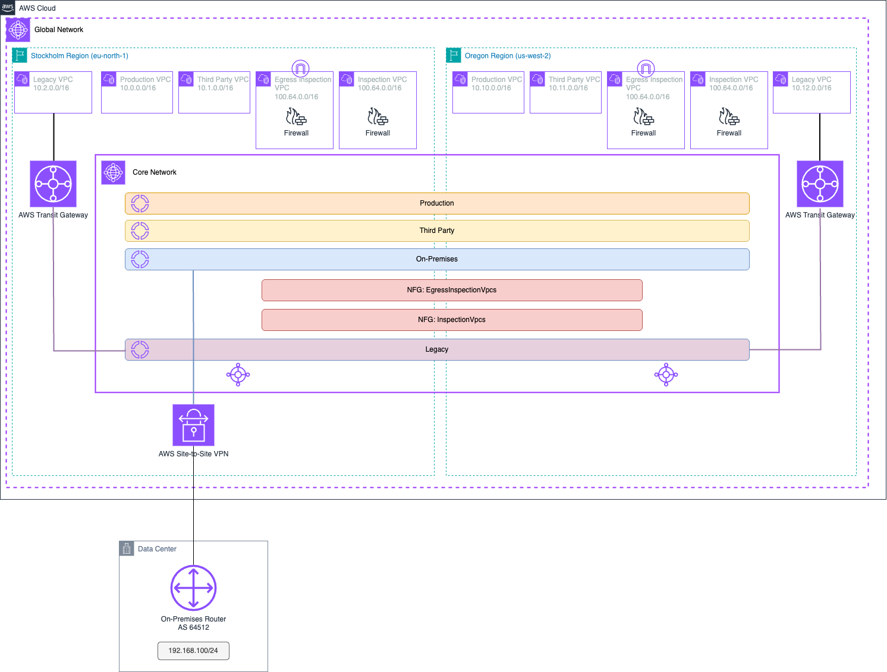

# AWS Cloud WAN - CloudFormation

AWS Cloud WAN is a managed wide-area networking (WAN) service that you can use to build, manage, and monitor an unified global network that connects resources running across your cloud and on-premises environments. It provides a central dashboard from which you can connect on-premises branch offices, data centers, and Amazon Virtual Private Clouds (VPCs) across the AWS global network. You can use simple network policies to centrally configure and automate network management and security tasks, and get a complete view of your global network.

This repository shows you an example in AWS CloudFormation of global communication with AWS Cloud WAN, showing the same architecture you can build in the [AWS Cloud WAN Workshop](https://catalog.workshops.aws/cloudwan/en-US).

**NOTE**: The resources created incur costs in your AWS Account. Consider deleting the resources created once your tests are done. For more information, check the [AWS Cloud WAN pricing](https://aws.amazon.com/cloud-wan/pricing/).

## Deployment instructions

* Clone the repository
* If you want to follow the [workshop instructions](https://catalog.workshops.aws/cloudwan/en-US), move to the [Following the lab instructions](#following-the-lab-instructions) section.
* If you want to test out the code outside the lab instructions, check carefully each stack and the resources it deploys:
  * `Workloads.yaml` creates the spoke VPCs.
  * `Inspection.yaml` creates both Inspection VPCs (egress and east-west).
  * `Legacy.yaml` creates the legacy infrastructure with Transit Gateway.
  * `OnPremises.yaml` creates the *mock on-premises* in eu-west-2 (London).
  * `VPN.yaml` creates the VPN connection resources.

## Following the lab instructions

**NOTE**: The final state of both workshop labs is codified in this repository. However, some pieces are commented or only deployed if specific parameters are configured. Check below to understand how to deploy the environment for each different state.

### Lab 1 - Build a global, segmented network with central egress

1. If you want to follow the lab guide:
  * `make deploy-initial` to build the initial environment.
2. If you want to build the end architecture after finishing the steps:
  * Uncomment lines 54-80 and 90-114 in `CoreNetwork.yaml`.
  * Execute `make deploy-lab1`.

Use `make undeploy` to clean-up the test environment and avoid undesired charges.

### Lab 2 - Federate with AWS Transit Gateway

1. If you want to follow the lab guide:
  * Check point 2 above to uncomment the corresponding lines and do `make deploy-lab1` to build the initial environment.
  * Follow [Step 6](https://catalog.workshops.aws/cloudwan/en-US/3-labs/lab1/step-6) in the workshop guide to configure the VPN connection.
2. If you want to build the end architecture after finishing the steps:
  * Uncomment everything in `CoreNetwork.yaml`.
  * Execute `make deploy-lab2`.

Use `make undeploy` to clean-up the test environment and avoid undesired charges.